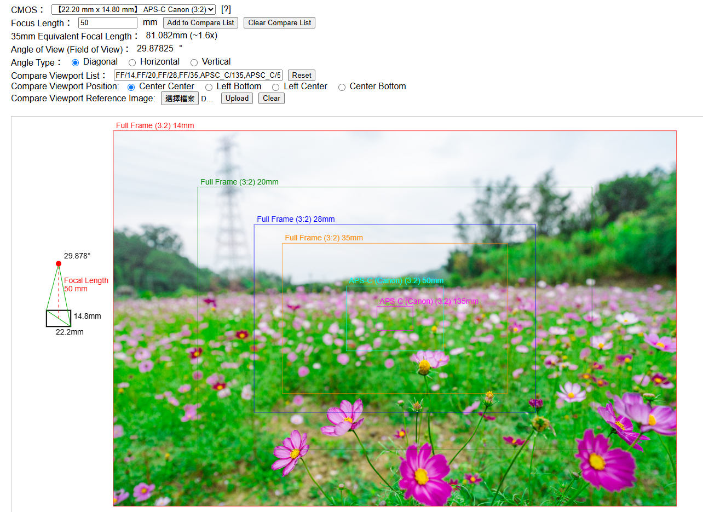

# LensAngleViewCalculator

Camera Lens Angle of View Calculator (Web) 相機鏡頭可視角度計算機 (線上版)

An advanced web-based tool for precisely calculating and visualizing the field of view (FOV) for various camera sensors and lens combinations.

Live Demo (線上使用) [LINK](https://lens-angle.weil.app.wbftw.org/angle.htm)

## Feature

- Comprehensive Sensor Support: Calculate FOV for any sensor size from medium format to smartphone sensors (over 40 different sensor formats included)
- High-Precision Angular Calculations: Get accurate diagonal, horizontal, and vertical field of view angles for any given focal length
- 35mm Equivalent Conversion: Automatically displays the 35mm equivalent focal length and crop factor (e.g., APS-C = 1.5x)
- Visual Representation: See a graphical representation of your field of view with clear rectangular outlines
- Comparative Analysis: Compare multiple sensor/lens combinations simultaneously to understand coverage differences
- Reference Image Support: Upload reference images to visualize how different sensor sizes would crop the same scene
- Flexible Alignment Options: Choose between multiple alignment modes including center, bottom-left, left-center, and bottom-center

## Screenshot

## Supported CMOS Size

P.S: CMOS sensor size does not refer to diagonal line but to the size of vacuum camera tubes, which is why a '1-inch' sensor actually measures 12.8 mm x 9.6 mm, with a diagonal of 0.63'' (16mm), not corresponding to the traditional meaning of a 1-inch sensor.

| Code | Size (mm) | Name | Ratio |
|  ----  | ----  | --- | --- |
| MF_H | 53.40 × 40.00 | Medium Format (Hasselblad H6D-100c) | 4:3 |
| MF_PH | 44.00 × 33.00 | Medium Format (Phase One, Hasselblad X1D) | 4:3 |
| MF_GFX | 43.80 × 32.90 | Medium Format (Fujifilm GFX) | 4:3 |
| FF | 36.00 × 24.00 | FullFrame | 3:2 |
| APSH | 27.90 × 18.60 | APS-H | 3:2 |
| APSC_S | 23.60 × 15.60 | APS-C (Sony, Fujifilm, Nikon) | 3:2 |
| APSC_C | 22.20 × 14.80 | APS-C Canon | 3:2 |
| 1_8in | 21.90 × 16.40 | 1.8″ | 4:3 |
| 1_7in | 20.80 × 15.60 | 1.7″ | 4:3 |
| 1_6in | 20.10 × 15.05 | 1.6″ | 4:3 |
| 1_5in | 18.70 × 14.00 | 1.5″ | 4:3 |
| 1_4in | 18.00 × 13.50 | 1.4″ | 4:3 |
| M43 | 17.30 × 13.00 | M43 | 4:3 |
| 1_2in | 16.00 × 12.00 | 1.2″ | 4:3 |
| 1_1in | 14.70 × 11.00 | 1.1″ | 4:3 |
| 1in | 12.80 × 9.60 | 1″ | 4:3 |
| 1in1_1 | 11.60 × 8.70 | 1/1.1″ | 4:3 |
| 1in1_2 | 10.67 × 8.00 | 1/1.2″ | 4:3 |
| 1in1_3 | 9.60 × 7.20 | 1/1.3″ | 4:3 |
| 1in1_4 | 8.90 × 6.67 | 1/1.4″ | 4:3 |
| 2in3 | 8.80 × 6.60 | 2/3″ | 4:3 |
| 1in1_6 | 8.00 × 6.00 | 1/1.6″ | 4:3 |
| 1in1_7 | 7.60 × 5.70 | 1/1.7″ | 4:3 |
| 1in1_8 | 7.20 × 5.40 | 1/1.8″ | 4:3 |
| 1in1_9 | 6.80 × 5.10 | 1/1.9″ | 4:3 |
| 1in2 | 6.67 × 5.00 | 1/2″ | 4:3 |
| 1in2_1 | 6.40 × 4.80 | 1/2.1″ | 4:3 |
| 1in2_2 | 6.16 × 4.62 | 1/2.2″ | 4:3 |
| 1in2_3 | 6.00 × 4.50 | 1/2.3″ | 4:3 |
| 1in2_4 | 5.90 × 4.43 | 1/2.4″ | 4:3 |
| 1in2_5 | 5.76 × 4.29 | 1/2.5″ | 4:3 |
| 1in2_6 | 5.50 × 4.10 | 1/2.6″ | 4:3 |
| 1in2_7 | 5.30 × 4.00 | 1/2.7″ | 4:3 |
| 1in2_8 | 5.10 × 3.83 | 1/2.8″ | 4:3 |
| 1in2_9 | 4.90 × 3.67 | 1/2.9″ | 4:3 |
| 1in3 | 4.80 × 3.60 | 1/3″ | 4:3 |
| 1in3_2 | 4.54 × 3.42 | 1/3.2″ | 4:3 |
| 1in3_6 | 4.00 × 3.00 | 1/3.6″ | 4:3 |
| 1in4 | 3.60 × 2.70 | 1/4″ | 4:3 |
| 1in5 | 2.88 × 2.16 | 1/5″ | 4:3 |

## How It Works

The calculator uses precise optical formulas to determine the exact field of view based on the relationship between the focal length and sensor dimensions. Unlike simplified approximations, this tool accounts for the actual angular geometry to provide the most accurate results possible.

## Technical Details

The calculator uses advanced trigonometric functions to compute the precise angular field of view rather than relying on approximations. All calculations happen in real-time on the client side with no server dependencies.

## Contributing

Contributions to improve the calculator are welcome. Please feel free to submit issues or pull requests to enhance functionality or fix bugs.